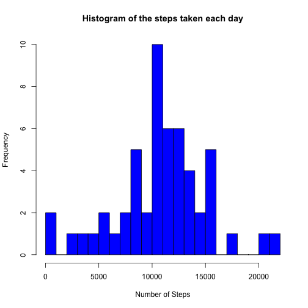
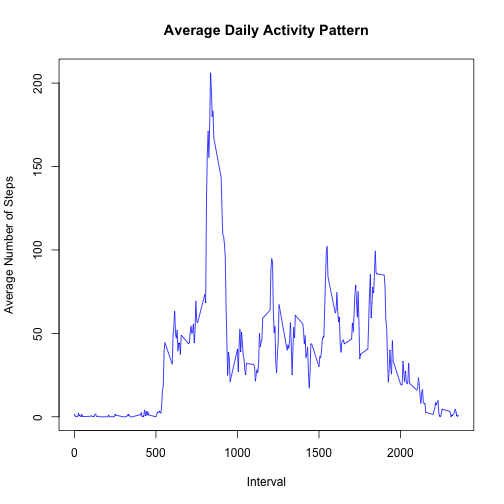
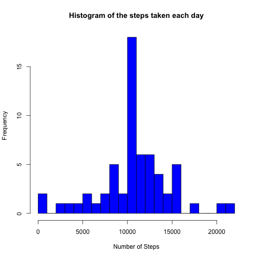
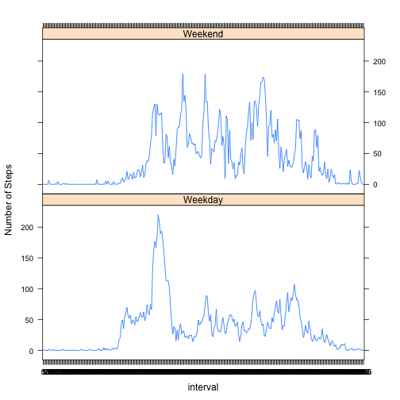

### Introduction

It is now possible to collect a large amount of data about personal movement using activity monitoring devices such as a Fitbit, Nike Fuelband, or Jawbone Up. These type of devices are part of the "quantified self" movement -- a group of enthusiasts who take measurements about themselves regularly to improve their health, to find patterns in their behavior, or because they are tech geeks. But these data remain under-utilized both because the raw data are hard to obtain and there is a lack of statistical methods and software for processing and interpreting the data.

This assignment makes use of data from a personal activity monitoring device. This device collects data at 5 minute intervals through out the day. The data consists of two months of data from an anonymous individual collected during the months of October and November, 2012 and include the number of steps taken in 5 minute intervals each day.


```r
# Download the file
if(!file.exists("./data")){dir.create("./data")}
fileUrl <- "https://d396qusza40orc.cloudfront.net/repdata%2Fdata%2Factivity.zip"
download.file(fileUrl,destfile="./data/repdata%2Fdata%2Factivity.zip",method="curl")

# Unzip the file and create path_rf and files
unzip(zipfile="./data/repdata%2Fdata%2Factivity.zip",exdir="./data")
path_rf <- file.path("./data" , "Dataset")
files <- list.files(path_rf, recursive=TRUE)

# Read the data
data <- read.csv("./data/activity.csv", header = TRUE, sep = ",", na.strings = "NA")

# Convert data format
data$date <- as.Date(data$date, format = "%Y-%m-%d")
data$interval <- factor(data$interval)

# Ignore Missing Values
NA_index <- is.na(as.character(data$steps))
data_no_NA <- data[!NA_index,]
head(data_no_NA)
```

```
##     steps       date interval
## 289     0 2012-10-02        0
## 290     0 2012-10-02        5
## 291     0 2012-10-02       10
## 292     0 2012-10-02       15
## 293     0 2012-10-02       20
## 294     0 2012-10-02       25
```

```r
# Data frame with the steps for a day
steps_each_day <- aggregate(steps ~ date, data = data_no_NA, sum)

# Add column names
colnames(steps_each_day) <- c("date", "steps")

# Histogram of dataset
hist(as.numeric(steps_each_day$steps), breaks = 20, col = "blue", xlab = "Number of Steps", main= "Histogram of the steps taken each day")
```



```r
# Mean
mean(steps_each_day$steps)
```

```
## [1] 10766.19
```

```r
# Median
median(steps_each_day$steps)
```

```
## [1] 10765
```

```r
# Average
steps_per_interval <- aggregate(data_no_NA$steps, by=list(interval=data_no_NA$interval), FUN=mean)

# Add columns names
colnames(steps_per_interval) <- c("interval", "average_steps")

# Plot the average daily activity pattern 
plot(as.integer(levels(steps_per_interval$interval)), steps_per_interval$average_steps, type="l",
     xlab = "Interval", ylab = "Average Number of Steps", main = "Average Daily Activity Pattern",  col ="blue")
```



```r
# Maximum number of average steps
max_steps <- max(steps_per_interval$average_steps)
max_steps
```

```
## [1] 206.1698
```

```r
# 5-min interval that contains the max number of steps
intervale_max_steps<-steps_per_interval[which.max(steps_per_interval$average_steps),]$interval
intervale_max_steps
```

```
## [1] 835
## 288 Levels: 0 5 10 15 20 25 30 35 40 45 50 55 100 105 110 115 120 ... 2355
```

```r
# Input missing values
sum(is.na(as.character(data$steps)))
```

```
## [1] 2304
```

```r
sum(is.na(as.character(data$date)))
```

```
## [1] 0
```

```r
sum(is.na(as.character(data$interval)))
```

```
## [1] 0
```

```r
# Find the indices of missing values (NAs)
NA_index <- which(is.na(as.character(data$steps)))
complete_data <- data

# Input missing values using the mean for that 5-min
complete_data[NA_index, ]$steps<-unlist(lapply(NA_index, FUN=function(NA_index){
  steps_per_interval[data[NA_index,]$interval==steps_per_interval$interval,]$average_steps
}))

# Check the complete data with the summary and str
summary(complete_data)
```

```
##      steps             date               interval    
##  Min.   :  0.00   Min.   :2012-10-01   0      :   61  
##  1st Qu.:  0.00   1st Qu.:2012-10-16   5      :   61  
##  Median :  0.00   Median :2012-10-31   10     :   61  
##  Mean   : 37.38   Mean   :2012-10-31   15     :   61  
##  3rd Qu.: 27.00   3rd Qu.:2012-11-15   20     :   61  
##  Max.   :806.00   Max.   :2012-11-30   25     :   61  
##                                        (Other):17202
```

```r
str(complete_data)
```

```
## 'data.frame':	17568 obs. of  3 variables:
##  $ steps   : num  1.717 0.3396 0.1321 0.1509 0.0755 ...
##  $ date    : Date, format: "2012-10-01" "2012-10-01" ...
##  $ interval: Factor w/ 288 levels "0","5","10","15",..: 1 2 3 4 5 6 7 8 9 10 ...
```

```r
# Create a data frame with the steps taken for each day
steps_each_day_complete <- aggregate(steps ~ date, data = complete_data, sum)

# Add column names to the created data frame
colnames(steps_each_day_complete) <- c("date", "steps")

# Histogram
hist(as.numeric(steps_each_day_complete$steps), breaks = 20, col = "blue", xlab = "Number of Steps", main= "Histogram of the steps taken each day")
```



```r
# Mean
mean(steps_each_day_complete$steps)
```

```
## [1] 10766.19
```

```r
# Median
median(steps_each_day_complete$steps)
```

```
## [1] 10766.19
```

```r
# Create a factor variable
complete_data$day <- as.factor(weekdays(complete_data$date))

# Create a logical variable
complete_data$is_weekday <- ifelse(!(complete_data$day %in% c("Sabado","Domingo")), TRUE, FALSE) 
# Calculate the avg number of steps for weekdays
weekdays_data <- complete_data[complete_data$is_weekday,]
steps_per_interval_weekdays <- aggregate(weekdays_data$steps, by = list(interval = weekdays_data$interval), FUN = mean)

# Calculate the avg number of steps for weekends
weekends_data <- complete_data[!complete_data$is_weekday,]
steps_per_interval_weekends <- aggregate(weekends_data$steps, by = list(interval = weekends_data$interval), FUN = mean)

# Add columns names
colnames(steps_per_interval_weekdays) <- c("interval", "average_steps")
colnames(steps_per_interval_weekends) <- c("interval", "average_steps")

# Add a column
steps_per_interval_weekdays$day <- "Weekday"
steps_per_interval_weekends$day <- "Weekend"

# Merge
week_data <- rbind(steps_per_interval_weekends, steps_per_interval_weekdays)

# Convert
week_data$day <- as.factor(week_data$day)

# Plot
library(lattice)
xyplot(average_steps ~  interval | day, data = week_data, layout = c(1,2), type ="l", ylab="Number of Steps")
```




